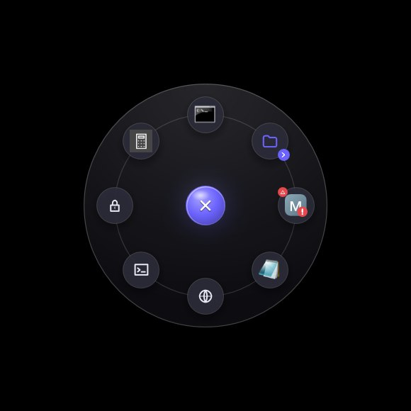
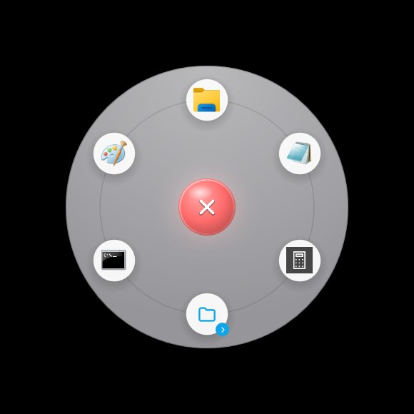
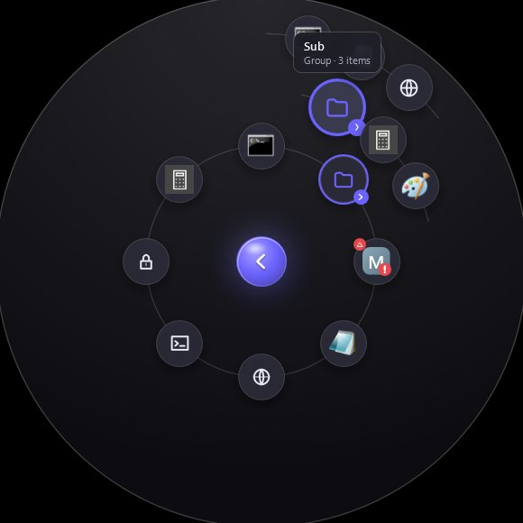
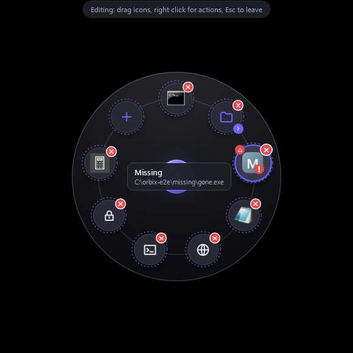
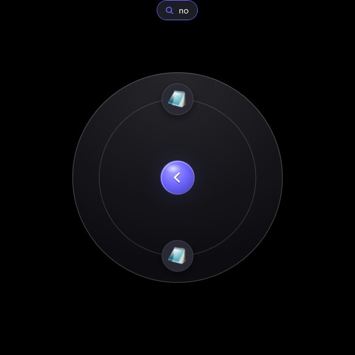

# Orbix

Радиальное меню быстрого запуска для Windows, живущее в системном лотке: полупрозрачный
«орб» в центре экрана, по щелчку или глобальной горячей клавише раскрывающийся в кольцо
значков приложений. Папки открываются вторыми и третьими орбитами, всё управляется мышью,
клавиатурой и колесом, редактируется перетаскиванием.

Стек: **C# + WPF, .NET 8** (одно самодостаточное `Orbix.exe`). Win32 используется там, где
он нужен: `RegisterHotKey` для глобальных клавиш, `HKCU\Software\Microsoft\Windows\CurrentVersion\Run`
для автозапуска, Shell API (`SHGetFileInfo` / `IExtractImage`) для значков, layered-окно с
попиксельной прозрачностью для click-through вне круга.

## Возможности

- Орб: всегда поверх всех окон, строго по центру основного монитора (или монитора под курсором),
  настраиваемые размер (32–160 px), прозрачность в покое, «дыхание», свой цвет или картинка;
  вне круга окно полностью прозрачно для мыши.
- Режимы видимости: всегда / только поверх рабочего стола / автоскрытие в полноэкранных
  приложениях и играх.
- Меню: ровное кольцо настраиваемого радиуса, группы-орбиты (3+ уровня вложенности, «назад» —
  центральный орб), появление за ~30–90 мс, размытие фона (акрил), тени, тултипы, hover-зум.
- Поиск набором текста в открытом меню, клавиши: стрелки / цифры / Tab / Enter / колесо,
  Ctrl+E — режим правки, Ctrl+Z — вернуть удалённое, Esc — закрыть.
- Правка: перетаскивание и перегруппировка прямо в меню, добавление перетаскиванием
  `.exe` / `.lnk` / папок / файлов, окно параметров (файл, имя, значок, аргументы, «от администратора»).
- Лоток: открыть меню, показать/скрыть орб, параметры, автозапуск, выход. Горячие клавиши
  по умолчанию: **Ctrl+Alt+Space** (меню) и **Ctrl+Alt+O** (показать/скрыть орб), обе настраиваемые.
- Один экземпляр: второй запуск активирует первый и передаёт ему команду (`--open`, `--settings`…).
- Конфигурация: `%APPDATA%\RadialLauncher\config.json`, автосохранение, экспорт/импорт,
  восстановление после порчи файла; темы тёмная/светлая/системная, акцентный цвет, RU/EN.

Экранные снимки сделаны end-to-end тестом на реальном рабочем столе (GitHub Actions):

| орб в покое | меню | светлая тема |
|---|---|---|
|  |  |  |

| вложенные орбиты | режим правки | поиск набором текста |
|---|---|---|
|  |  |  |

## Сборка и запуск

Нужен .NET SDK 8.0 (для сборки; собранный portable-вариант работает без установленного рантайма).

```powershell
dotnet build Orbix.sln -c Release          # сборка
dotnet test  Orbix.sln -c Release          # модульные тесты (97 шт.)
dotnet run --project src/Orbix -c Release  # запуск приложения
```

Портативный один файл (self-contained, win-x64):

```powershell
pwsh build/publish.ps1 -Variant portable
# -> artifacts\portable\Orbix.exe
```

Установщик (нужен Inno Setup 6, `iscc` в PATH):

```powershell
pwsh build/publish.ps1 -Variant portable -Installer
# -> artifacts\Orbix-Setup-<версия>.exe
```

Ключи командной строки: `--open` (открыть меню), `--settings` (окно параметров),
`--toggle-orb` (показать/скрыть орб), `--minimized`, `--exit`, `--debug`.
Переменные окружения: `ORBIX_DATA_DIR` (другой каталог данных), `ORBIX_LOG=debug`
(подробный журнал в `orbix.log`).

## Устройство репозитория

```
Orbix.sln                  решение (Core, Orbix, тесты)
Directory.Build.props      общие свойства компиляции
build/
  publish.ps1              portable / framework-dependent / installer
  installer.iss            сценарий Inno Setup
  make-icon.py             генерация Assets/orbix.ico
ci/
  build.ps1 test.ps1       шаги CI с аннотациями
  publish.ps1              публикация в CI
  e2e.ps1 e2e-window.ps1   end-to-end тест на реальном рабочем столе
  E2E.Native.cs            Win32-хелперы теста (SendInput, WindowFromPoint, снимки)
  emit-shots.ps1           устаревший канал снимков (аннотации)
src/Orbix.Core/            платформа-независимое ядро (net8.0)
  Models/                  AppConfig, Settings, RadialItem, MenuProfile, перечисления
  Layout/                  RadialLayout, LayoutPlanner, LabelPlacer (геометрия колец)
  Services/                ConfigService (JSON, автосейв, экспорт/импорт), DataPaths
  Hotkeys/ HotkeyGesture   разбор сочетаний («Ctrl+Alt+Space»)
  Search/ ItemSearch       поиск по набору текста
  Localization/            Loc + таблица строк RU/EN
src/Orbix/                 приложение WPF (net8.0-windows)
  Program.cs AppHost.cs    вход, одиночный экземпляр, композиция служб
  Native/Win32.cs          P/Invoke
  Services/                HotkeyService, IconService, LaunchService, FullscreenWatcher,
                           TrayService, ThemeService, BackdropService, AutostartService,
                           SingleInstance, MouseHookService, Logger
  UI/                      OverlayWindow (орб+меню+правка), MenuView*, ItemVisual, OrbVisual
  UI/Settings/             окно параметров (6 страниц), HotkeyBox, ItemEditorPanel, LocExtension
  Themes/Styles.xaml       стили окна параметров (кисти публикует ThemeService)
tests/Orbix.Core.Tests/    97 тестов: геометрия, конфиг, поиск, нормализация, Loc
.github/workflows/         CI: сборка+тесты и e2e на windows-latest со снимками экрана
docs/img/                  снимки из e2e-прогона
```

## Данные и конфигурация

`%APPDATA%\RadialLauncher\config.json` (camelCase, перечисления — строками). Там же хранятся
пользовательские значки (`icons/`) и резервные копии после импорта/порчи. Автозапуск — значение
`Orbix` в `HKCU\Software\Microsoft\Windows\CurrentVersion\Run`.

## Лицензия

GNU GPL v3 — см. `LICENSE`.
